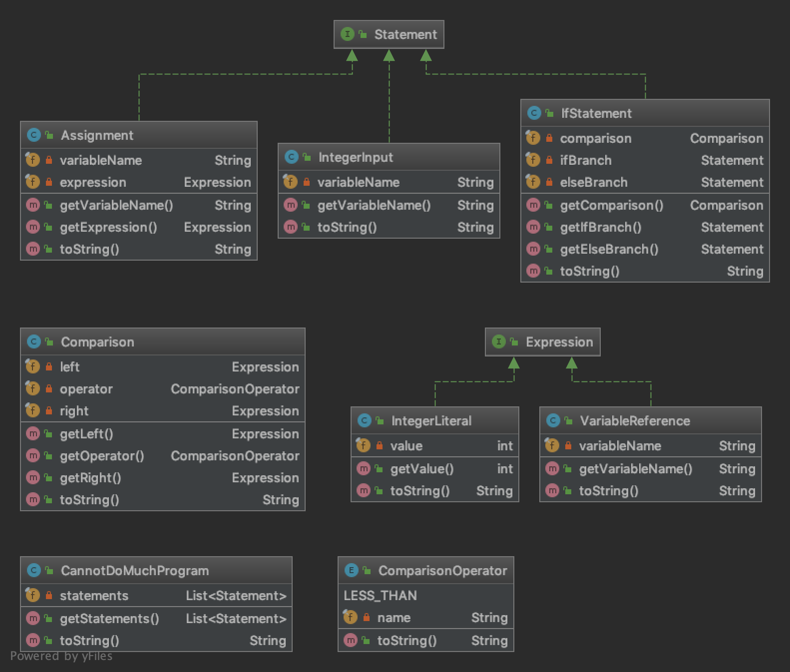

*2019*
# The mighty oracle for 'CannotDoMuch#' programs

### Zusammenfassung

Imagine you are working for a very wicked software company. Everyone in this company writes software using a language called CannotDoMuch#. The language is very limited, but it is sufficient to write programs for the company's clients, because they are also very wicked. They do not care about the actual behavior of the software - the only thing they care about is that you can - for any given number - precisely say whether your program can produce this number as output (or not).

What? Too wicked? Let's look at an example. Here is a sample CannotDoMuch# program:

INPUT x
IF x < 0 THEN
    x = 42
ELSE
    x = 23
END

In the first line, the program will ask the user to input an integer number. Then, depending on the entered number, the program will either assign 42 or 23 to the variable x. It is easy to see that once the program is done, x will be either 42 or 23. There is no way that x can have any other value. And this is exactly what the clients want to know.

Obviously, your co-workers write tens of thousands of such programs every day, because the clients have a high demand for this kind of software. Also, since CannotDoMuch# is so limited in its functionality, the only way to keep up with the clients' requirements is to write more code.

Your boss is a smart guy (after all, he invented CannotDoMuch#) and therefore asks you to automate this task of checking whether a CannotDoMuch# program can produce a certain output or not. He has already done most of the heavy-lifting and has defined an interface which you need to implement called:

CannotDoMuchProgramAnalyzer

He asks you to implement this interface such that he can pass in a CannotDoMuch# program, the name of a variable and a concrete value (e.g., 42). Your implementation then just needs to return true if the variable can have this value when the program execution is done, or false if the variable cannot have this value.
He quickly explains that the CannotDoMuch# programs are passed to your analyzer as object tree where each object in the tree represents a piece of code. So there is an IntegerInput class to represent INPUT statements, an IfStatement class to represent IF/THEN/ELSE statements, an Assignment class to assign expressions to variables, and some more classes which (he is sure of) you'll figure out by yourself. Then, he drives off with his Ferrari into the sunset right after reminding you that this needs to be done by tomorrow morning.

## STAGE 1

### Zielstellung

Since you have no clue how to analyze CannotDoMuch# programs, you check out some of your co-workers' code and pick a program that looks simple. As additional help you have found the following Class Diagram.

### Szenario 1: First contact with CannotDoMuch#

Let's dive into the code.

Given is the following simple program:

x = 42

In the first line, the program will assign 42 to x .

The object tree that corresponds to this program is:

CannotDoMuchProgram
- statements
    - Assignment
        - variableName: x
        - expression
            - IntegerLiteral
                - value: 42

When your CannotDoMuchProgramAnalyzer is asked whether x can be 18 after the program execution is done, it should return false , because x can only be 42 .

When your CannotDoMuchProgramAnalyzer is asked whether x can be 42 after the program execution is done, it should return true , because x can indeed be 42 .

Your CannotDoMuchProgramAnalyzer should analyze the given program . And work with other values.

### Szenario 2: Second contact with CannotDoMuch#

Let's try a more complex code.

Given is the following simple program:

x = 13
y = x
z = y

In the first line, the program will assign 13 to x . Then, the value of x is assigned to y , and later on y is assigned to the variable z .

The object tree that corresponds to this program is:

CannotDoMuchProgram
- statements
    - Assignment
        - variableName: x
        - expression
            - IntegerLiteral
                - value: 13
    - Assignment
        - variableName: y
        - expression
            - VariableReference
                - value: x
    - Assignment
        - variableName: z
        - expression
            - VariableReference
                - value: y

When your CannotDoMuchProgramAnalyzer is asked whether x can be 42 after the program execution is done, it should return false ,because x can only be 13 .

When your CannotDoMuchProgramAnalyzer is asked whether x can be 13 after the program execution is done, it should return true , because x can indeed be 13 .

When your CannotDoMuchProgramAnalyzer is asked whether y can be 23 after the program execution is done, it should return false ,because y can only be 13 .

When your CannotDoMuchProgramAnalyzer is asked whether y can be 13 after the program execution is done, it should return true , because y can indeed be 13 .

When your CannotDoMuchProgramAnalyzer is asked whether z can be 5 after the program execution is done, it should return false , because z can only be 13 .

When your CannotDoMuchProgramAnalyzer is asked whether z can be 13 after the program execution is done, it should return true , because z can indeed be 13 .

Your CannotDoMuchProgramAnalyzer should analyze the given program and work with other values.

## STAGE 2

### Zielstellung

Now that you're familiar with the variables and assignments in CannotDoMuch# programs, you check out some more code of your co-workers. Since you have no clue how to analyze CannotDoMuch# programs, you check out some of your co-workers' code and pick a program that looks simple. As additional help you have found the following Class Diagram.

### Szenario 1: Thirteen is not less than zero

Let's dive more into the code.

Given is the program of your co-workers:

x = 13
IF x < 0 THEN
    x = 8
ELSE
    x = 5
END

In the first line, the program will assign 13 to x . Then, depending on the fact whether x is smaller than 0 , the program will either assign 8 or 5 to the variable x .

The object tree that corresponds to this program is:

CannotDoMuchProgram
- statements
    - Assignment
        - variableName: x
        - expression
            - IntegerLiteral
                - value: 13
    - IfStatement
        - condition
            - Comparison
                - left
                    - VariableReference
                        - variableName: x
                - operator: LESS_THAN
                - right
                    - IntegerLiteral
                        - value: 0
        - ifBranch
            - Assignment
                - variableName: x
                - expression
                    - IntegerLiteral
                        - value: 8
        - elseBranch
            - Assignment
                - variableName: x
                - expression
                    - IntegerLiteral
                        - value: 5

When your CannotDoMuchProgramAnalyzer is asked whether x can be 8 after the program execution is done, it should return false , because 13 is not less than 0 .

When your CannotDoMuchProgramAnalyzer is asked whether x can be 5 after the program execution is done, it should return true .

When your CannotDoMuchProgramAnalyzer is asked whether x can be any other value after the program execution is done, it should return false .

Your CannotDoMuchProgramAnalyzer should analyze the given program and work with other values.

### Szenario 2: From Stage1: First contact with CannotDoMuch#

Let's dive into the code.

Given is the following simple program:

x = 42

In the first line, the program will assign 42 to x .

The object tree that corresponds to this program is:

CannotDoMuchProgram
- statements
    - Assignment
        - variableName: x
        - expression
            - IntegerLiteral
                - value: 42

When your CannotDoMuchProgramAnalyzer is asked whether x can be 18 after the program execution is done, it should return false , because x can only be 42 .

When your CannotDoMuchProgramAnalyzer is asked whether x can be 42 after the program execution is done, it should return true , because x can indeed be 42 .

Your CannotDoMuchProgramAnalyzer should analyze the given program . And work with other values.

### Szenario 3: From Stage1: Second contact with CannotDoMuch#

Let's try a more complex code.

Given is the following simple program:

x = 13
y = x
z = y

In the first line, the program will assign 13 to x . Then, the value of x is assigned to y , and later on y is assigned to the variable z .

The object tree that corresponds to this program is:

CannotDoMuchProgram
- statements
    - Assignment
        - variableName: x
        - expression
            - IntegerLiteral
                - value: 13
    - Assignment
        - variableName: y
        - expression
            - VariableReference
                - value: x
    - Assignment
        - variableName: z
        - expression
            - VariableReference
                - value: y

When your CannotDoMuchProgramAnalyzer is asked whether x can be 42 after the program execution is done, it should return false ,because x can only be 13 .

When your CannotDoMuchProgramAnalyzer is asked whether x can be 13 after the program execution is done, it should return true , because x can indeed be 13 .

When your CannotDoMuchProgramAnalyzer is asked whether y can be 23 after the program execution is done, it should return false ,because y can only be 13 .

When your CannotDoMuchProgramAnalyzer is asked whether y can be 13 after the program execution is done, it should return true , because y can indeed be 13 .

When your CannotDoMuchProgramAnalyzer is asked whether z can be 5 after the program execution is done, it should return false , because z can only be 13 .

When your CannotDoMuchProgramAnalyzer is asked whether z can be 13 after the program execution is done, it should return true , because z can indeed be 13 .

Your CannotDoMuchProgramAnalyzer should analyze the given program and work with other values.

## STAGE 3

### Zielstellung

So, you've handled variables, assignments and IF/ELSE statements. However, there is also the INPUT statement which prompts users to enter an integer number in a CannotDoMuch# program. So it is not much of a surprise that you find code that uses the INPUT statement. Since you have no clue how to analyze CannotDoMuch# programs, you check out some of your co-workers' code and pick a program that looks simple. As additional help you have found the following Class Diagram.

### Szenario 1: Users that enter numbers are the worst

Almost there! You are becoming real CannotDoMuch# profi.

One example program that does so is shown here:

INPUT x
IF x < 0 THEN
    IF x < 2 THEN
        y = 3
    ELSE
        y = -1
    END
ELSE
    y = x
END

In the first line, the program will prompt the user for input and assign the entered number x . Then, depending on the fact whether x is smaller than 0 , the program will either execute another (nested) IF statement or assign x to y . The nested IF statement will assign 3 to y (if x is less than 2 ) or else assign -1 to y .

The object tree that corresponds to this program is:

CannotDoMuchProgram
- statements
    - IntegerInput
        - variableName: x
    - IfStatement
        - condition
            - Comparison
                - left
                    - VariableReference
                        - variableName: x
                - operator: LESS_THAN
                - right
                    - IntegerLiteral
                        - value: 0
        - ifBranch
            - IfStatement
                - condition
                    - Comparison
                        - left
                            - VariableReference
                                - variableName: x
                        - operator: LESS_THAN
                        - right
                            - IntegerLiteral
                                - value: 2
                - ifBranch
                    - Assignment
                        - variableName: y
                        - expression
                            - IntegerLiteral
                                - value: 3
                - elseBranch
                    - Assignment
                        - variableName: y
                        - expression
                            - IntegerLiteral
                                - value: -1
        - elseBranch
            - Assignment
                - variableName: y
                - expression
                    - VariableReference
                        - value: x

When your CannotDoMuchProgramAnalyzer is asked whether x can be 8 after the program execution is done, it should return true , because the user can enter any number, which makes 8 a valid potential value for x .

When your CannotDoMuchProgramAnalyzer is asked whether y can be 5 after the program execution is done, it should return true , because y will be 5 if the user enters 5 .

When your CannotDoMuchProgramAnalyzer is asked whether y can be 0 after the program execution is done, it should return true , because y will be 0 if the user enters 0 .

When your CannotDoMuchProgramAnalyzer is asked whether y can be 3 after the program execution is done, it should return true , because y will be 3 if the user enters -1 or 3 .

When your CannotDoMuchProgramAnalyzer is asked whether y can be -1 after the program execution is done, it should return false , because there is no input the user can enter that will yield value -1 for y .

Your CannotDoMuchProgramAnalyzer should analyze the given program and work with other values.

### Szenario 2: From Stage2: Thirteen is not less than zero

Let's dive more into the code.

Given is the program of your co-workers:

x = 13
IF x < 0 THEN
    x = 8
ELSE
    x = 5
END

In the first line, the program will assign 13 to x . Then, depending on the fact whether x is smaller than 0 , the program will either assign 8 or 5 to the variable x .

The object tree that corresponds to this program is:

CannotDoMuchProgram
- statements
    - Assignment
        - variableName: x
        - expression
            - IntegerLiteral
                - value: 13
    - IfStatement
        - condition
            - Comparison
                - left
                    - VariableReference
                        - variableName: x
                - operator: LESS_THAN
                - right
                    - IntegerLiteral
                        - value: 0
        - ifBranch
            - Assignment
                - variableName: x
                - expression
                    - IntegerLiteral
                        - value: 8
        - elseBranch
            - Assignment
                - variableName: x
                - expression
                    - IntegerLiteral
                        - value: 5

When your CannotDoMuchProgramAnalyzer is asked whether x can be 8 after the program execution is done, it should return false , because 13 is not less than 0 .

When your CannotDoMuchProgramAnalyzer is asked whether x can be 5 after the program execution is done, it should return true .

When your CannotDoMuchProgramAnalyzer is asked whether x can be any other value after the program execution is done, it should return false .

Your CannotDoMuchProgramAnalyzer should analyze the given program and work with other values.

### Szenario 3: From Stage1: First contact with CannotDoMuch#

Let's dive into the code.

Given is the following simple program:

x = 42

In the first line, the program will assign 42 to x .

The object tree that corresponds to this program is:

CannotDoMuchProgram
- statements
    - Assignment
        - variableName: x
        - expression
            - IntegerLiteral
                - value: 42

When your CannotDoMuchProgramAnalyzer is ask whether x can be 18 after the program execution is done, it should return false , because x can only be 42 .

When your CannotDoMuchProgramAnalyzer is ask whether x can be 42 after the program execution is done, it should return true , because x can indeed be 42 .

Your CannotDoMuchProgramAnalyzer should analyze the given program . And work with other values.

### Szenario 4: From Stage1: Second contact with CannotDoMuch#

Let's try a more complex code.

Given is the following simple program:

x = 13
y = x
z = y

In the first line, the program will assign 13 to x . Then, the value of x is assigned to y , and later on y is assigned to the variable z .

The object tree that corresponds to this program is:

CannotDoMuchProgram
- statements
    - Assignment
        - variableName: x
        - expression
            - IntegerLiteral
                - value: 13
    - Assignment
        - variableName: y
        - expression
            - VariableReference
                - value: x
    - Assignment
        - variableName: z
        - expression
            - VariableReference
                - value: y

When your CannotDoMuchProgramAnalyzer is asked whether x can be 42 after the program execution is done, it should return false ,because x can only be 13 .

When your CannotDoMuchProgramAnalyzer is asked whether x can be 13 after the program execution is done, it should return true , because x can indeed be 13 .

When your CannotDoMuchProgramAnalyzer is asked whether y can be 23 after the program execution is done, it should return false ,because y can only be 13 .

When your CannotDoMuchProgramAnalyzer is asked whether y can be 13 after the program execution is done, it should return true , because y can indeed be 13 .

When your CannotDoMuchProgramAnalyzer is asked whether z can be 5 after the program execution is done, it should return false , because z can only be 13 .

When your CannotDoMuchProgramAnalyzer is asked whether z can be 13 after the program execution is done, it should return true , because z can indeed be 13 .

Your CannotDoMuchProgramAnalyzer should analyze the given program and work with other values.
