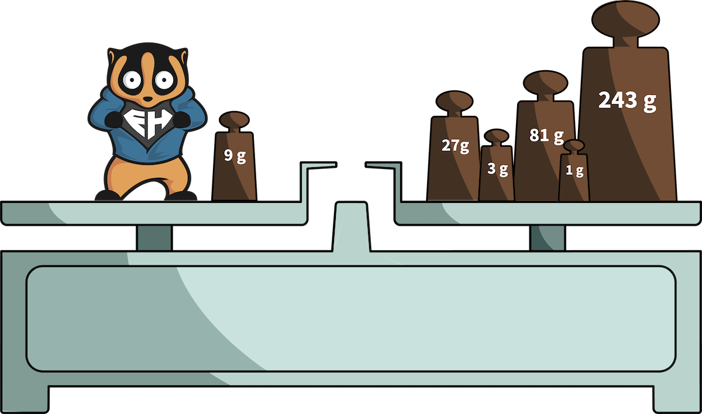

# Weigh the Slow Loris (Hard Mode)

__Zusammenfassung__

Your Baby Slow Loris is growing up fast. You remember that you have another set of calibrated masses to weigh heavier objects. This sounds easy? The difficulty is that you also have to put masses on the left plate where your Slow Loris is sitting. Your new algorithm receives the weight of Slow Loris and returns how much you have to place on which plate.

__Zielstellung__

Your task is to write an algorithm which receive the weigh of the animal and return the different masses (gram) which are used in an List of ArrayLists.

__Szenario 1: Our tiny Slow Loris got heavy!__

In this scenario you have a list of calibrated masses. For every weight (of the Slow Loris) which is given to your function you should return a List of ArrayLists with the masses you need for weighing the Slow Loris. Note that you can use every single mass only once! In some cases you don't need to take all of the masses. Also note that your Slow Loris sits on the left plate.

Given is a List<Integer> which includes all calibrated masses of the balance: allMasses = [1, 3, 9, 27, 81, 243]
  
Your Slow Loris weighs 346 grams.

Your function should return an List<ArrayList<Integer>> with two lists (the first for the left plate, the second for the right plate): [[leftPlate], [rightPlate]] .
  
Your list should look like this: result = [[9], [1, 3, 27, 81, 243]]

Your algorithm should work with lighter and heavier Slow Loris as well.
